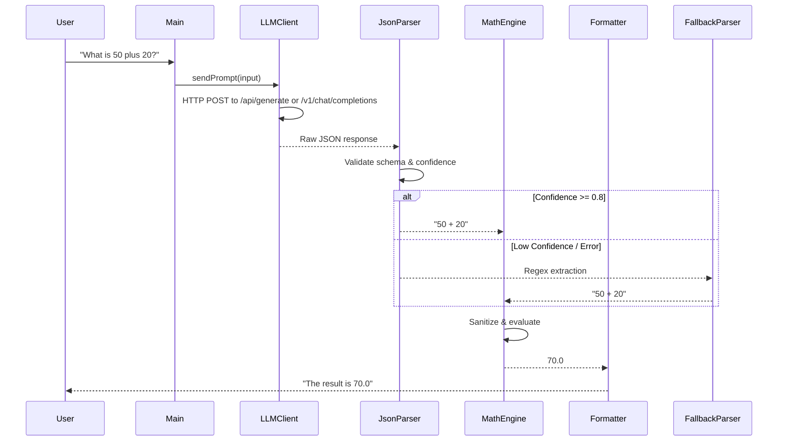

Here is the fourth document: **`TECHNICAL_DESIGN.md`**. This covers the architecture, class structure, data flow, and Linux/WSL-specific implementation details.

***

# `TECHNICAL_DESIGN.md`

```markdown
# Technical Design Document
## Project: Java LLM Calculator (JLC)
## Version: 1.0
## Target Runtime: Java 17+ | Linux / WSL2

---

## 1. Architecture Overview
JLC follows a **Hybrid Pipeline Architecture**:
1. **Input Layer:** CLI or programmatic string input.
2. **AI Parsing Layer:** LLM extracts mathematical intent and returns structured JSON.
3. **Validation Layer:** Java verifies JSON structure, checks confidence score, and sanitizes expression.
4. **Computation Layer:** Safe Java math engine evaluates the expression.
5. **Output Layer:** Result formatted and returned to user.

```
[User Input] → [LLM Client] → [JSON Parser] → [Math Engine] → [Formatter] → [Output]
                      ↓              ↓              ↓
               [Fallback Regex] [Sanitizer]   [Error Handler]
```

---

## 2. Core Modules & Responsibilities

| Class/Module | Responsibility | Key Methods |
|--------------|----------------|-------------|
| `Main.java` | CLI entry, loop, arg parsing | `main()`, `runInteractive()`, `runSingleQuery()` |
| `Config.java` | Load `.env`, manage LLM mode | `load()`, `getLlmMode()`, `getApiKey()` |
| `LLMClient.java` | HTTP calls to Ollama/OpenAI | `parseIntent(String input)`, `buildRequest()`, `handleResponse()` |
| `JsonParser.java` | Deserialize LLM JSON output | `extractExpression(String json)`, `validateConfidence()` |
| `MathEngine.java` | Safe arithmetic evaluation | `evaluate(String expression)`, `sanitize()`, `handleDivisionByZero()` |
| `ResponseFormatter.java` | Generate user-friendly output | `formatResult(String query, double result)`, `formatError()` |
| `FallbackParser.java` | Regex-based backup if LLM fails | `extractWithRegex(String input)` |

---

## 3. Data Flow (Sequence)



---

## 4. LLM Integration Details

### 4.1 HTTP Client (Java 11+ `java.net.http`)
- Uses `HttpClient.newBuilder().connectTimeout(Duration.ofSeconds(5)).build()`
- Supports two endpoints:
  - **Ollama (Local):** `POST http://localhost:11434/api/generate`
  - **OpenAI (Cloud):** `POST https://api.openai.com/v1/chat/completions`

### 4.2 Request Payload Construction
```json
// Ollama Format
{
  "model": "llama3",
  "prompt": "You are a Math Intent Parser... [system rules] ... User: {input}",
  "stream": false,
  "format": "json"
}

// OpenAI Format
{
  "model": "gpt-3.5-turbo",
  "messages": [
    {"role": "system", "content": "[AI_INSTRUCTIONS.md content]"},
    {"role": "user", "content": "{input}"}
  ],
  "response_format": {"type": "json_object"}
}
```

### 4.3 Response Handling
- Parse using `Gson` or `Jackson`.
- Validate `confidence >= 0.75`. If lower, trigger `FallbackParser`.
- Strip markdown code blocks (````json ... ````) before parsing.

---

## 5. Math Engine & Safety

### 5.1 Why Not `ScriptEngine`?
`javax.script.ScriptEngine` is deprecated in Java 15+ and poses security risks (arbitrary code execution). JLC uses a **safe, restricted evaluator**.

### 5.2 Recommended Approach
- **Library:** `exp4j` or `mXparser` (lightweight, math-only, no code execution).
- **Alternative (Zero-Deps):** Custom Shunting-Yard algorithm or recursive descent parser supporting `+ - * / ( )`.

### 5.3 Sanitization Rules
Before evaluation, the engine must:
1. Allow only: `0-9`, `.`, `+`, `-`, `*`, `/`, `(`, `)`, whitespace.
2. Reject any alphabetic characters or symbols.
3. Normalize `×` → `*`, `÷` → `/`.
4. Catch `ArithmeticException` for division by zero.

```java
// Example sanitization regex
private static final Pattern SAFE_MATH = Pattern.compile("^[0-9+\\-*/().\\s]+$");
public static boolean isSafe(String expr) {
    return SAFE_MATH.matcher(expr).matches();
}
```

---

## 6. Error Handling & Fallbacks

| Scenario | Handling Strategy |
|----------|-------------------|
| LLM API Timeout | Retry once (2s backoff), then fallback to regex parser |
| Malformed JSON | Log warning, use `FallbackParser.java` |
| Low Confidence (<0.75) | Bypass LLM result, use regex extraction |
| Invalid Math Syntax | Return: `"I couldn't understand that calculation. Try: 5 + 3"` |
| Division by Zero | Return: `"Cannot divide by zero."` |
| No Math Detected | Return: `"That doesn't look like a math problem. Try asking a calculation!"` |

---

## 7. WSL / Linux Specifics

### 7.1 Networking (Ollama in WSL2)
WSL2 uses a virtual NAT. `localhost` inside WSL may not reach Windows-hosted Ollama.
**Fix:** Bind Ollama to `0.0.0.0` or use Windows host IP:
```bash
# In Windows PowerShell
$env:OLLAMA_HOST="0.0.0.0"
ollama serve

# In WSL .env
OLLAMA_HOST=http://$(cat /etc/resolv.conf | grep nameserver | awk '{print $2}'):11434
```

### 7.2 File Paths & Encoding
- Use `Paths.get()` and `System.getProperty("user.home")` for cross-platform safety.
- Force UTF-8: `System.setProperty("file.encoding", "UTF-8");`
- CLI input reading: `new Scanner(System.in, "UTF-8")`

### 7.3 Headless Operation
- No AWT/Swing dependencies in core module.
- GUI (if added later) must be optional and gated behind `--gui` flag.

---

## 8. Dependencies & Build

### `pom.xml` (Maven) Core Dependencies
```xml
<dependencies>
    <!-- JSON Parsing -->
    <dependency>
        <groupId>com.google.code.gson</groupId>
        <artifactId>gson</artifactId>
        <version>2.10.1</version>
    </dependency>
    <!-- Environment Variables -->
    <dependency>
        <groupId>io.github.cdimascio</groupId>
        <artifactId>dotenv-java</artifactId>
        <version>3.0.0</version>
    </dependency>
    <!-- Safe Math Evaluation -->
    <dependency>
        <groupId>net.objecthunter</groupId>
        <artifactId>exp4j</artifactId>
        <version>0.4.8</version>
    </dependency>
</dependencies>
```

### Build Command
```bash
mvn clean package -DskipTests
java -jar target/jlc-1.0.jar
```

---

## 9. Extensibility (V2 Roadmap)
- [ ] Scientific functions (`sin`, `cos`, `log`, `^`)
- [ ] Unit conversion ("5 miles to km")
- [ ] Memory/History (`last`, `clear`, `recall`)
- [ ] Multi-language NLP support
- [ ] TUI/GUI with automatic calculation on input change

---
```

***

**Status:** `TECHNICAL_DESIGN.md` is ready.
**Next Step:** When you say **"next"**, I will generate the **`IMPLEMENTATION_GUIDE.md`** (Step-by-step Java code snippets, WSL setup commands, and testing workflow).
